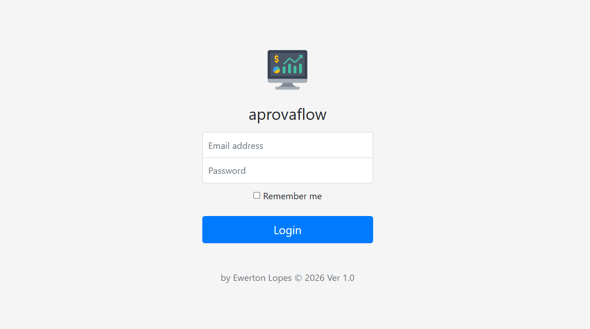
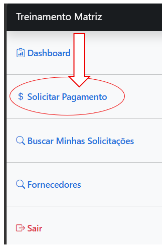
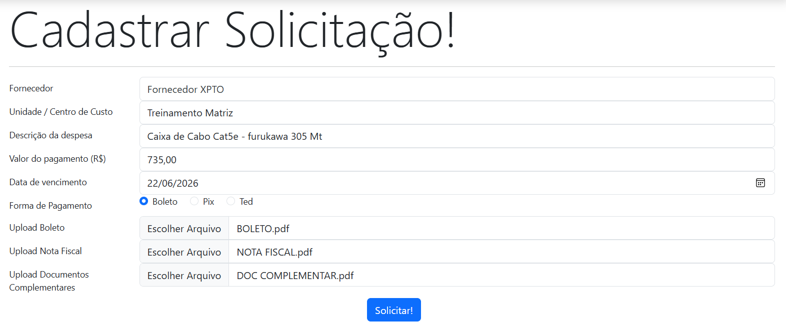
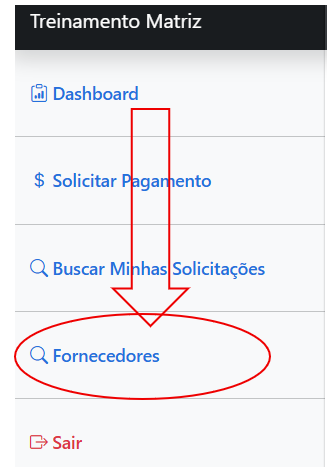
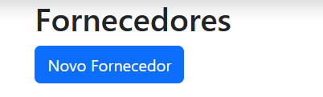
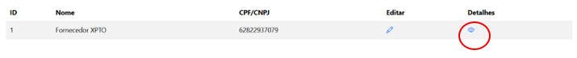
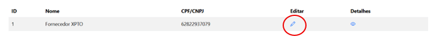
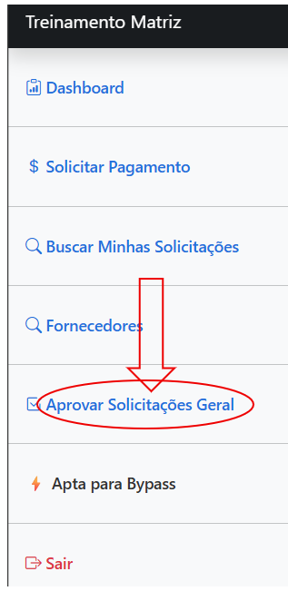
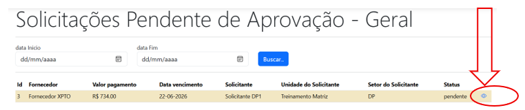

# 📘 Manual do Usuário — Sistema Contas a Pagar

## 1. Introdução

O sistema **Contas a Pagar** foi criado para facilitar o controle de solicitações de pagamento dentro da empresa.

Com ele, colaboradores podem solicitar pagamentos, acompanhar aprovações e o setor financeiro realiza o processamento até o pagamento final.

Este manual explica de forma simples como usar o sistema no dia a dia.

---

## 2. Perfis de Acesso

O sistema possui diferentes tipos de usuários:

### 👤 Colaborador (Solicitante)

* Cria solicitações de pagamento
* Acompanha status das solicitações

### ✔️ Aprovador

* Analisa solicitações
* Pode aprovar ou recusar

### 💰 Financeiro

* Lança pagamentos no sistema
* Efetua pagamentos
* Pode recusar ou cancelar solicitações

### ⚙️ Administrador

* Controle total do sistema
* Gerencia usuários e permissões

---

## 3. Como Criar uma Solicitação

Para criar uma solicitação de pagamento:

1. Acesse o sistema
2. Clique em **“Solicitar Pagamento”**

3. Preencha os campos:

   * Fornecedor (Obs: caso Fornecedor desejado nao apareça na lista cadastrar no Menu Fornecedores (Seção **"Como Cadastrar Fornecedor"**)
   * Unidade / Centro de Custo (Caso Não encontre na listagem, solicitar admin para cadastrar)
   * Descrição da despesa
   * Valor do pagamento
   * Data de vencimento
   * Forma de pagamento (Boleto, Pix ou TED) (Dados do Pix e TEd , ja vem do cadastro do fornecedor , pode editar direto na solicitação e depois corrigir o cadastro do fornecedor) 
4. Anexe os documentos necessários:

   * Boleto (se houver)
   * Nota fiscal
   * Documentos complementares (Obs: esse doc em pdf server como um relatorio mais detalhado da solicitação caso precisar ou campo descrição da despesa não seja suficiente!)
5. Clique em **Solicitar**

Após isso, a solicitação entrará no fluxo de aprovação.

---

## 4. Como Cadastrar um Fornecedor

Caso o fornecedor ainda não esteja cadastrado no sistema, será necessário realizar o cadastro antes de criar a solicitação de pagamento.

### Passo a Passo

1. Acesse o menu **Fornecedores**

2. Clique em **Novo Fornecedor**

3. Preencha as informações solicitadas:

   * Nome do fornecedor
   * CPF ou CNPJ
   * Chave Pix (quando aplicável)
   * Dados bancários
   * Nome do destinatário do pagamento
   * CPF ou CNPJ do destinatário
4. Revise as informações cadastradas
5. Clique em **Salvar**

Após o cadastro, o fornecedor ficará disponível para seleção nas solicitações de pagamento.

### Importante

* Verifique se o CPF/CNPJ foi informado corretamente.
* Confirme os dados bancários antes de salvar.
* Evite cadastrar o mesmo fornecedor mais de uma vez.
* Em caso de dúvida, consulte o setor financeiro.

### Consultar Fornecedores

Para localizar um fornecedor já cadastrado:

1. Acesse o menu **Fornecedores**

3. Clique no icone de Olho para visualizar os dados do Fornecedor

### Editar Fornecedor

Caso seja necessário atualizar alguma informação:

1. Acesse o menu fornecedor

2. Localize o fornecedor
3. Clique em **Editar**

4. Atualize os dados necessários
5. Clique em **Salvar**

As alterações ficarão disponíveis imediatamente para novas solicitações.

## 5. Como Funciona o Fluxo

Depois de enviada, a solicitação segue este caminho:

Solicitante
→ Aprovação
→ Financeiro
→ Pagamento

Cada etapa precisa ser concluída para avançar para a próxima.

---

## 6. Como Aprovar uma Solicitação

Para aprovadores:

1. Acesse o menu **“Aprovar Solicitações”**

2. Abra a solicitação pendente

3. Analise os dados e documentos
4. Escolha uma ação:

   * **Aprovar**
   * **Recusar**
5. Confirme a ação

Se aprovada, a solicitação segue para a próxima etapa.A depender do fluxo que estar configurada para essa empresa !!

---

## 7. Como Recusar uma Solicitação

Qualquer aprovador ou financeiro pode recusar uma solicitação quando necessário.

Para recusar:

1. Abra a solicitação
2. Clique em **Recusar**
3. Informe o motivo da recusa
4. Confirme

A solicitação será encerrada com status **Recusado**.

---

## 8. Como Lançar um Pagamento (Financeiro)

Após a aprovação, o financeiro realiza o lançamento:

1. Acesse a solicitação aprovada
2. Clique em **“Lançar Pagamento”**
3. Confirme os dados
4. O sistema registrará a solicitação como **Lançado**

Isso significa que o pagamento foi registrado internamente, mas ainda não foi pago.

---

## 9. Como Efetuar um Pagamento

Para concluir o pagamento:

1. Acesse a solicitação no status **Lançado**
2. Clique em **“Efetuar Pagamento”**
3. Anexe o comprovante em PDF
4. Informe a data do pagamento
5. Confirme a operação

Após isso, o status será alterado para **Pago**.

---

## 10. Significado dos Status

### ⏳ Pendente

A solicitação está aguardando aprovação.

### ⚠️ Aguardando Master

A solicitação precisa de aprovação especial.

### ✔️ Aprovado

Todas as aprovações foram concluídas.

### 📌 Lançado

O financeiro registrou a solicitação, mas ainda não pagou.

### 💰 Pago

O pagamento foi concluído com sucesso.

### ❌ Recusado

A solicitação foi rejeitada.

### 🚫 Cancelado

A solicitação foi cancelada.

---

## 11. Recursos Importantes

### 🔎 Detecção de Solicitações Semelhantes

O sistema pode identificar solicitações parecidas para evitar pagamentos duplicados.

Se isso acontecer, será exibido um aviso antes de enviar.

---

### 📎 Comprovantes de Pagamento

Todo pagamento exige o envio de um comprovante em PDF para registro.

---

## 12. Boas Práticas de Uso

* Sempre confira os dados antes de enviar a solicitação
* Anexe todos os documentos necessários
* Evite duplicar solicitações
* Acompanhe regularmente o status das suas solicitações
* Informe corretamente o centro de custo

---

## 13. Perguntas Frequentes (FAQ)

### ❓ Posso editar uma solicitação depois de enviada?

Depende do status. Em geral, apenas solicitações pendentes podem ser alteradas.

---

### ❓ O que acontece se minha solicitação for recusada?

Ela será encerrada e não seguirá no fluxo. Você pode criar uma nova solicitação corrigida.

---

### ❓ Quanto tempo leva para aprovar uma solicitação?

Depende do fluxo de aprovação da sua empresa.

---

### ❓ Posso cancelar uma solicitação?

Sim, desde que ela ainda não tenha sido paga.

---

### ❓ O que significa “Lançado”?

Significa que o financeiro registrou a solicitação, mas o pagamento ainda não foi feito.

---

## 14. Considerações Finais

Este sistema foi criado para organizar e dar transparência ao processo de pagamentos.

Em caso de dúvidas, procure o setor financeiro ou o administrador do sistema.
